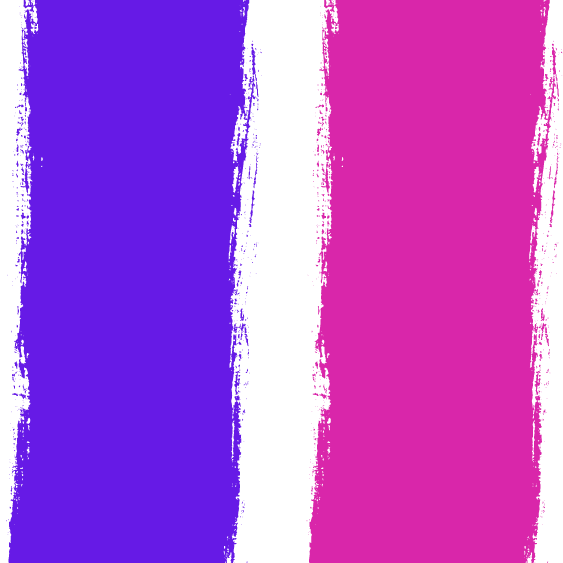

<!-- PROJECT LOGO -->
<br />
<div align="center">
  <a href="https://github.com/corentings/astrocket">
    
  </a>

<h3 align="center">Astrocket Frontend</h3>
  <p align="center">
    A frontend for the astrocket project
    <br />
    <a href="https://github.com/CorentinGS/Astrocket/documentation"><strong>Explore the docs »</strong></a>
    <br />
    <br />
    <a href="https://astrocket.corentings.dev">View Demo</a>
    ·
    <a href="https://github.com/corentings/astrocket/issues">Report Bug</a>
    ·
    <a href="https://github.com/corentings/astrocket/issues">Request Feature</a>
  </p>
</div>

<!-- TOC -->

- [About The Project](#about-the-project)
  - [Built With](#built-with)
- [Getting Started](#getting-started)
  - [Prerequisites (for development)](#prerequisites-for-development)
  - [Installation (I assume you have a backend running)](#installation-i-assume-you-have-a-backend-running)
    - [Using Docker](#using-docker)
    - [Using Docker Compose](#using-docker-compose)
    - [Using Devbox (recommended)](#using-devbox-recommended)
- [Architecture](#architecture)
  - [Pages](#pages)
  - [Components](#components)
  - [Configuration](#configuration)
- [Roadmap](#roadmap)
- [Contact](#contact)
<!-- TOC -->

<!-- ABOUT THE PROJECT -->

## About The Project

[![Astrocket Screen Shot][product-screenshot]](https://astrocket.corentings.dev)

Astrocket is a web-based chat app (like an IRC) that provides a modern interface, storage for messages, and secured
account creation using oauth2. It’s designed with self-hosting in mind and allows users to deploy their instance quickly
and easily using prebuilt docker images.
Thus, people don’t need to worry about their privacy as they can control their data/messages and don’t rely on
third-party providers such as Microsoft, Google, or Discord.

<p align="right">(<a href="#readme-top">back to top</a>)</p>

### Built With

This section should list any major frameworks/libraries used to bootstrap your project. Leave any add-ons/plugins for
the acknowledgements section. Here are a few examples.

- [![Astro][Astro.build]][Astro-url]
- [![Solid][Solid.js]][Solid-url]
- [![Tailwind][Tailwindcss]][Tailwind-url]
- [![Daisyui][Daisyui.com]][Daisyui-url]
- [![Docker][Docker.com]][Docker-url]
- <a href="https://jetpack.io/devbox/docs/contributor-quickstart/">
      
  </a>

<p align="right">(<a href="#readme-top">back to top</a>)</p>

<!-- GETTING STARTED -->

## Getting Started

To get a local copy up and running follow these simple steps.

### Prerequisites (for development)

- Node.js (v18+)
- Yarn (or npm or pnpm or whatever you want)
- Docker (optional)
- Docker Compose (optional)
- A backend (see [Astrocket Backend](../backend))
- Devbox (optional)

### Installation (I assume you have a backend running)

1. Clone the repo (or fork it if you want to contribute)

```sh
git clone https://github.com/CorentinGS/Astrocket.git
```

2. cd into the project

```sh
cd frontend
```

Note: If you want to use docker or devbox, you can skip the following steps

3. Install dependencies

```sh
yarn install
```

You can also use npm or pnpm

If you get an error about the `sharp` package, you need to install the dependencies for your system. See
the [sharp documentation](https://sharp.pixelplumbing.com/install#cross-platform) for more information.

Easy workaround for Linux:

```sh
yarn add sharp --ignore-engines
```

4. Launch the project

```sh
yarn dev
```

5. Open your browser and go to http://localhost:4321
6. Enjoy!

#### Using Docker

3. Build the docker image

```sh
docker build -t astrocket-frontend .
```

4. Run the docker image

```sh
docker run -p 4321:4321 astrocket-frontend
```

5. Open your browser and go to http://localhost:4321

#### Using Docker Compose

3. Run the docker-compose

```sh
docker-compose up
```

4. Open your browser and go to http://localhost:4321

#### Using Devbox (recommended)

3. Run the devbox

```sh
devbox run dev
```

4. Open your browser and go to http://localhost:4321

<!-- USAGE EXAMPLES -->

## Architecture

The frontend is built using [Astro](https://astro.build) and [Solid.js](https://www.solidjs.com/).
It uses [Tailwindcss](https://tailwindcss.com/) for styling and [DaisyUI](https://daisyui.com/) for components.

### Pages

The pages are located in the `src/pages` folder. They are written in `.astro` files and are composed of components.

- `index.astro` is the landing page, it's static generated and rendered on the server
- `login.astro` is the login page, it uses the solid `Login` component to display the login form. It's server-side
  rendered.
- `room.astro` is the room page, it uses the solid `Room` component to display the room. It's client-side rendered.
- `404.astro` is the 404 page, it's static generated and rendered on the server

### Components

The components are located in the `src/components` folder.

- `Login.tsx` is the login component, it's used to display the login form and handle the login process using oauth2
- `Room.tsx` is the room component, it's used to display the room and handle real-time messages.
- `Message.tsx` is the message component, it's used to display a message in the room.
- `AvatarDropdown.tsx` is the avatar component, it's used to display an avatar.

<p align="right">(<a href="#readme-top">back to top</a>)</p>

### Configuration

To configure the backend url, you can edit the [utils/pocketbase.ts](src/utils/pocketbase.ts) file.
The main astro config is located in the [astro.config.mjs](astro.config.mjs) file.

<!-- ROADMAP -->

## Roadmap

- [x] Make the app installable using PWA
- [ ] Add Changelog
- [ ] Add a way to change the theme
- [ ] Internationalization
  - [ ] French
  - [ ] German
- [ ] Emoji keyboard on desktop
- [ ] Profile page (with avatar upload)
- [ ] List of connected users
- [ ] Bold and italic text in messages
- [x] send messages with enter
- [x] Lazy load old messages when scrolling up

<p align="right">(<a href="#readme-top">back to top</a>)</p>

<!-- CONTACT -->

## Contact

CorentinGS - [@CorentinGS](https://github.com/corentings)

Project Link: [https://github.com/corentings/astrocket](https://github.com/corentings/astrocket)

<p align="right">(<a href="#readme-top">back to top</a>)</p>

<!-- ACKNOWLEDGMENTS -->

<!-- MARKDOWN LINKS & IMAGES -->
<!-- https://www.markdownguide.org/basic-syntax/#reference-style-links -->
<!-- https://github.com/othneildrew/Best-README-Template/tree/master -->

[product-screenshot]: public/landing.png
[Astro.build]: https://img.shields.io/badge/Astro-0C1222?style=for-the-badge&logo=astro&logoColor=FDFDFE
[Astro-url]: https://astro.build/
[Solid.js]: https://img.shields.io/badge/Solid%20JS-2C4F7C?style=for-the-badge&logo=solid&logoColor=white
[Solid-url]: https://www.solidjs.com/
[Tailwindcss]: https://img.shields.io/badge/Tailwind_CSS-38B2AC?style=for-the-badge&logo=tailwind-css&logoColor=white
[Tailwind-url]: https://tailwindcss.com/
[Daisyui.com]: https://img.shields.io/badge/daisyUI-1ad1a5?style=for-the-badge&logo=daisyui&logoColor=white
[Daisyui-url]: https://daisyui.com/
[Docker.com]: https://img.shields.io/badge/Docker-2CA5E0?style=for-the-badge&logo=docker&logoColor=white
[Docker-url]: https://www.docker.com/
